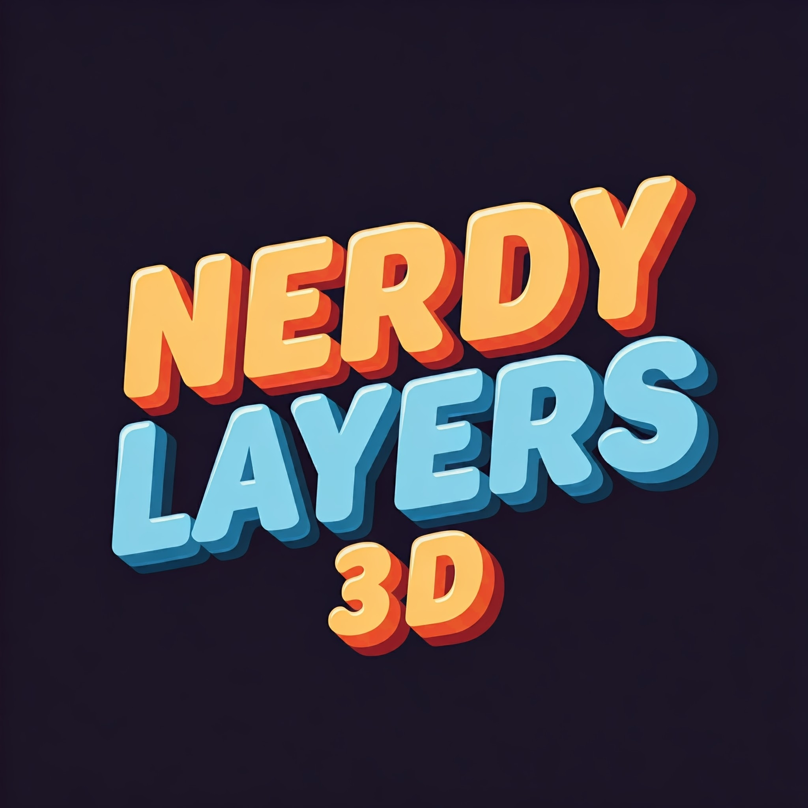

# Nerdy Layers 3D

Combat robotics builds, components, and design documentation.



## What's here

A statically-rendered Astro site that catalogues combat robot builds — chassis specs, CAD references, weapon and drive system configurations, and the components that go into each. Content is authored as Markdown (frontmatter + body) and rendered as themed pages.

Current robots:
- **Lucille MK2** — beetleweight, in development. Brushless 4WD with a front-mounted machined-aluminum drum and replaceable teeth.
- **Lucille (MK1)** — discontinued after Iberanime. Split metal-sleeved drum, brushed gearmotors, 2mm steel wedge.
- **Tank** — tracked combat platform (research / video project).

## Stack

- [Astro](https://astro.build) static site generator
- Content collections + Zod schemas
- Custom `remark-wiki-links` plugin to handle Obsidian-style `[[Page]]` and `![[image.png]]` syntax
- Theme palette and Fredoka display font matched to the **Nerdy Layers 3D** brand logo

## Local development

```sh
npm install
npm run dev
```

Site runs at `http://localhost:4321/`.

## Build

```sh
npm run build
```

Outputs static HTML to `dist/`.

## Content sync

Content originates from an Obsidian vault. The `scripts/sync-content.sh` script copies robot markdown files, components, and image assets into the Astro content collections. The script is **not** part of the deployed site — it's a developer tool.

To regenerate content from the vault (only relevant if you have the vault locally):

```sh
bash scripts/sync-content.sh
```

## Deployment

This repo is deployed via Cloudflare Pages. Pushes to `main` trigger an automatic build.

## License

Content © Nerdy Layers 3D. Code is permissively licensed for reuse.
